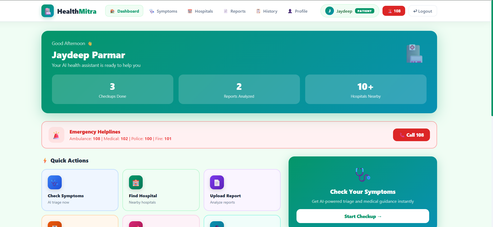
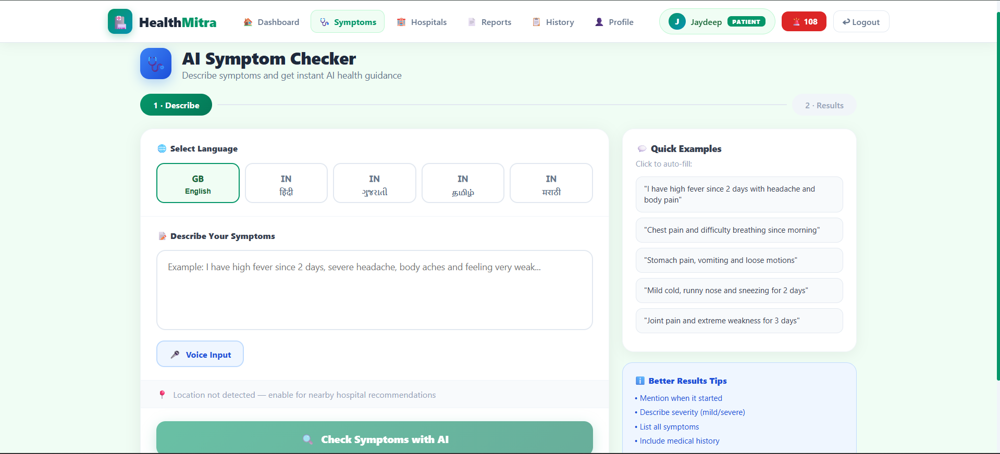
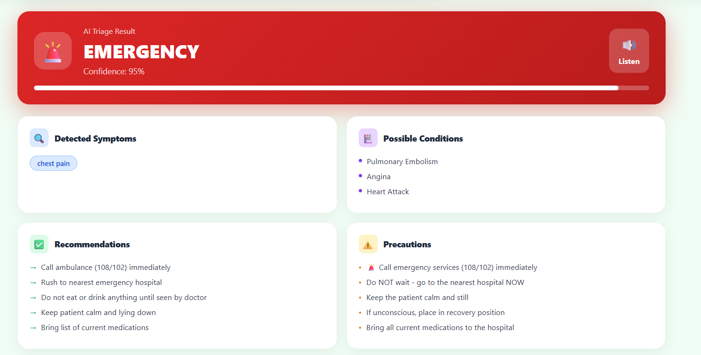
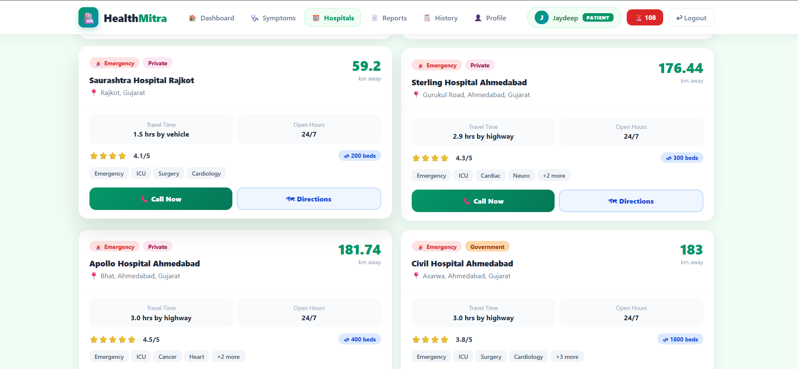
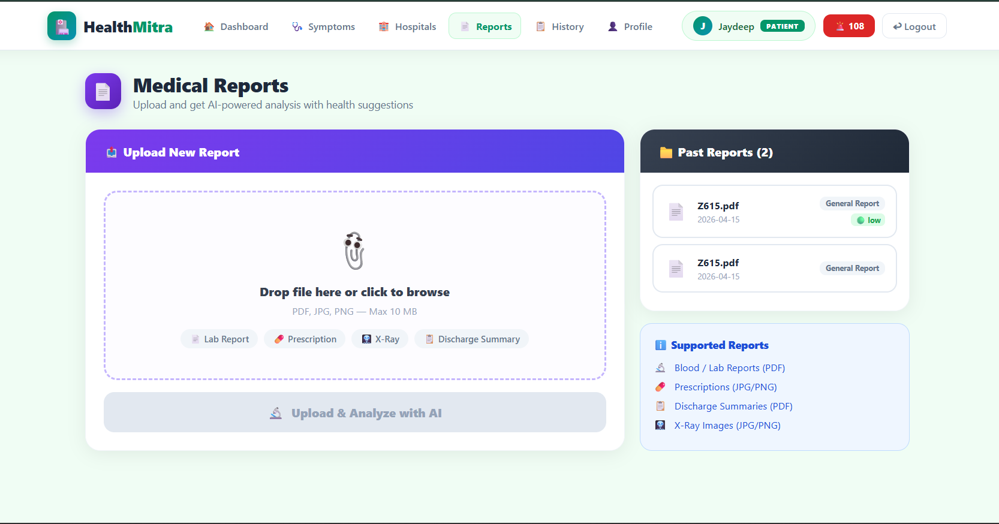
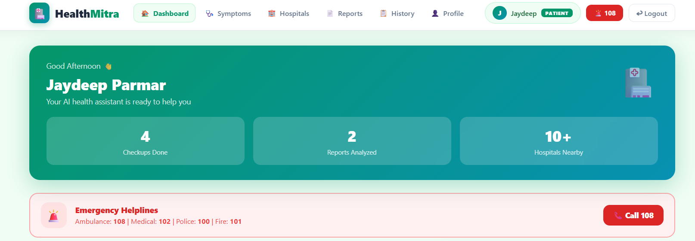

# 🏥 HealthMitra — AI-Powered Rural Health Assistant

HealthMitra is a full-stack healthcare application designed for rural India. It uses AI-powered symptom triage, multilingual support (English, Hindi, Gujarati, Tamil, Marathi), and GPS-based hospital discovery to bridge the gap between patients and healthcare access.

Built as a cloud-native application with React, FastAPI, MongoDB Atlas, and deployed via Docker on AWS EC2.

---

## ✨ Key Features

| Feature | Description |
|---|---|
| 🩺 **AI Symptom Checker** | Rule-based triage engine that classifies symptoms into 3 urgency levels: Self-Care, Visit Clinic, Emergency |
| 🌐 **Multilingual Support** | Input symptoms in 5 Indian languages with Groq/Llama-powered translation |
| 🏨 **Hospital Locator** | GPS-based nearest hospital finder using Haversine distance calculation |
| 📄 **Medical Report Analyzer** | Upload PDFs/images for AI-powered analysis via Groq Vision API |
| 💊 **Medicine Information** | OTC medicine recommendations, dosage info, and drug interaction checker |
| 🔊 **Voice Input** | Web Speech API integration for hands-free symptom entry |
| 👩‍⚕️ **ASHA Worker Dashboard** | Admin panel for community health workers with patient management and village-level analytics |
| 🔐 **JWT Authentication** | Role-based access control (Patient / ASHA Worker) |

---

## 🛠️ Tech Stack

| Layer | Technology |
|---|---|
| **Frontend** | React 19, React Router, Axios, Leaflet Maps, TailwindCSS |
| **Backend** | Python FastAPI, Pydantic, Motor (async MongoDB driver) |
| **Database** | MongoDB Atlas |
| **AI/ML** | Groq Llama 3.3 70B (triage translation, report analysis) + Llama 3.2 Vision |
| **Auth** | JWT (python-jose), SHA256 + salt password hashing |
| **Deployment** | Docker, Docker Compose, Nginx reverse proxy, AWS EC2 |
| **APIs** | Web Speech API, Geolocation API, IP-based location fallback |

---

## 📁 Project Structure

```
healthmitra/
├── backend/
│   ├── app/
│   │   ├── models/          # Pydantic data models (user, triage, hospital, report)
│   │   ├── routes/          # FastAPI route handlers (auth, users, triage, hospitals, medicines, reports, admin)
│   │   ├── services/        # Business logic layer (triage engine, report analyzer, hospital finder)
│   │   └── utils/           # JWT token handler
│   ├── main.py              # FastAPI app entry point
│   ├── requirements.txt     # Python dependencies
│   └── Dockerfile
├── frontend/
│   ├── src/
│   │   ├── components/      # Navbar
│   │   ├── pages/           # Landing, Login, Register, Dashboard, SymptomChecker, Hospitals, Reports, History, Profile, AdminDashboard
│   │   ├── services/        # Axios API client
│   │   └── App.js           # Router + protected routes
│   ├── package.json
│   └── Dockerfile
├── nginx/                   # Reverse proxy config
├── docker-compose.yml       # Multi-container orchestration
└── README.md
```

---

## 🚀 How to Run

### Prerequisites
- Node.js 18+
- Python 3.11+
- MongoDB Atlas account (or local MongoDB)
- Groq API key (free at https://console.groq.com)

---

## Database

MongoDB Atlas — `healthmitra` database · 4 collections · 10 indexes

| Collection | Docs | Key Fields |
|------------|------|------------|
| `hospitals` | 20 | name, specialty, phone, GPS coords — **2dsphere indexed** |
| `users` | 17 | profile, language preference, health history, emergency contact |
| `triage_records` | 18 | input text, detected entities, triage level, advice, timestamp |
| `reports` | 4 | S3 key, extracted text, medicines[], test results[], uploaded_at |

---

## Screenshots

> 🌐 Live at **[http://13.232.60.226/](http://13.232.60.226/)**

| Main Dashboard | AI Symptom Checker | Triage Result |
|:-:|:-:|:-:|
|  |  |  |

| Hospital Locator | PDF Report Analyzer | Emergency SOS |
|:-:|:-:|:-:|
|  |  |  |

---

## Installation & Setup

**Prerequisites:** Docker, Docker Compose

### Local Development

**Backend:**
```bash
cd backend
python -m venv venv
source venv/bin/activate      # Windows: venv\Scripts\activate
pip install -r requirements.txt
cp .env.example .env          # Add your MongoDB URL and Groq API key
uvicorn main:app --reload --port 8000
```

**Frontend:**
```bash
cd frontend
npm install
npm start                     # Runs on http://localhost:3000
```

### Docker Deployment
```bash
# Set environment variables in .env at project root
docker-compose up --build -d
# App available at http://localhost (frontend) and http://localhost:8000 (API docs at /docs)
```

---

## 🔗 API Endpoints

| Method | Endpoint | Description |
|---|---|---|
| POST | `/api/auth/register` | Register new user |
| POST | `/api/auth/login` | Login and get JWT token |
| POST | `/api/triage/text` | Submit symptoms for AI triage |
| GET | `/api/triage/history` | Get triage history |
| GET | `/api/hospitals/nearby` | Find nearby hospitals by GPS |
| POST | `/api/reports/upload` | Upload medical report for AI analysis |
| GET | `/api/medicines/recommend` | Get medicine recommendations |
| GET | `/api/admin/stats` | System statistics (admin only) |

Full API docs available at `/docs` (Swagger UI) when backend is running.

---

## 📝 Architecture Highlights

- **Rule-based triage engine** with 60+ symptom patterns across 3 urgency tiers
- **Multilingual NLP** — keyword dictionaries for 4 languages + Groq/Llama fallback translation
- **Haversine distance** calculation for hospital proximity with 20+ seeded hospitals across India
- **Groq Vision API** for analyzing scanned medical reports and lab images
- **Role-based RBAC** — separate Patient and ASHA Worker interfaces

---

## ⚠️ Disclaimer

HealthMitra provides AI-based preliminary health guidance only. It is **not** a substitute for professional medical diagnosis. Always consult a qualified healthcare provider. In emergencies, call **108** (ambulance) or **102** (medical helpline).

---

## 📄 License

This project is for educational and portfolio purposes.
